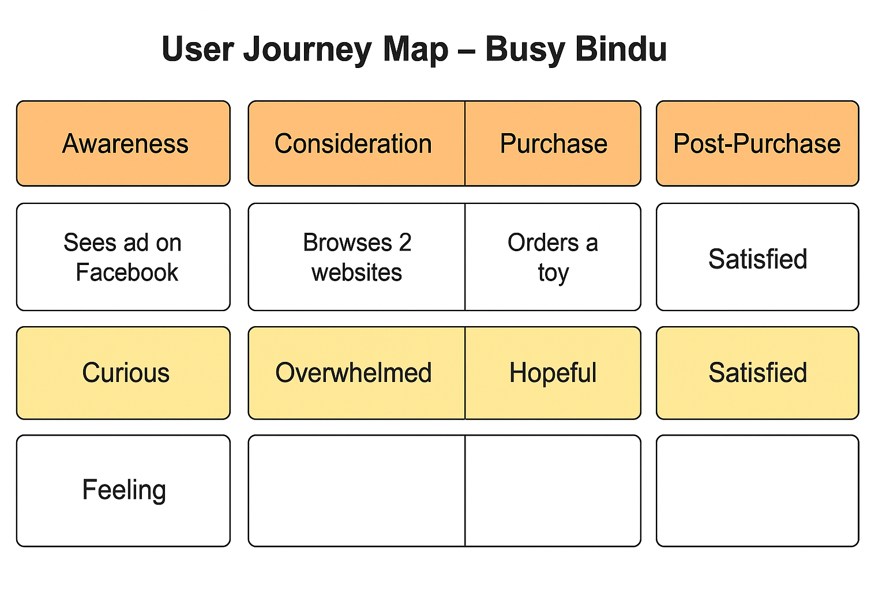

# Toystore Project

## Diagrams

- **Diagrame**: 
- **C4 Diagram**: 

## Description

This repository contains the source code and workflows for the Toystore project. The diagrams above provide a visual representation of the system architecture and design.

## Workflows

- **HTML Linter**: Ensures that all HTML files in the repository adhere to coding standards.
- **Super-Linter**: A comprehensive linter for validating code across multiple languages and formats, including GitHub Actions workflows.

## How to Use

1. Clone the repository:
   ```bash
   git clone https://github.com/your-repo/toystore.git
   ```
